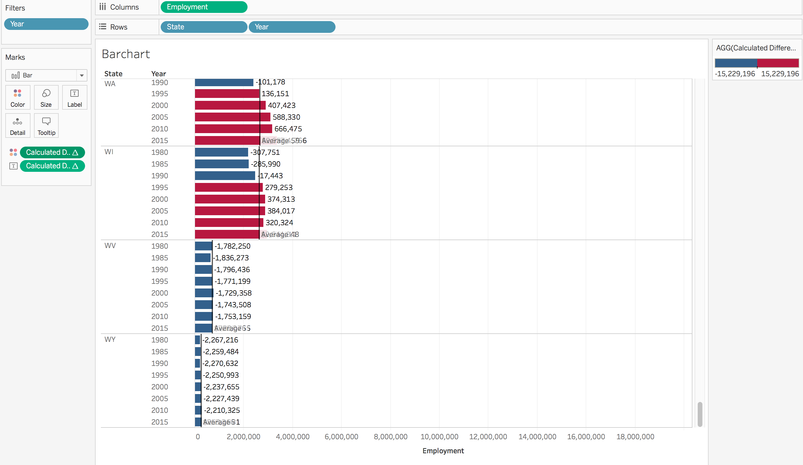
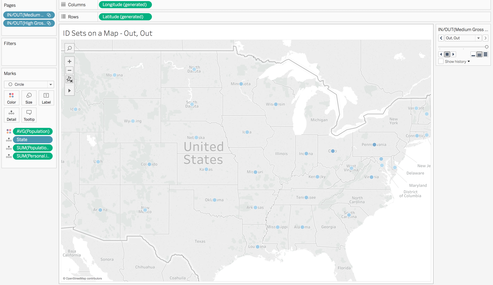
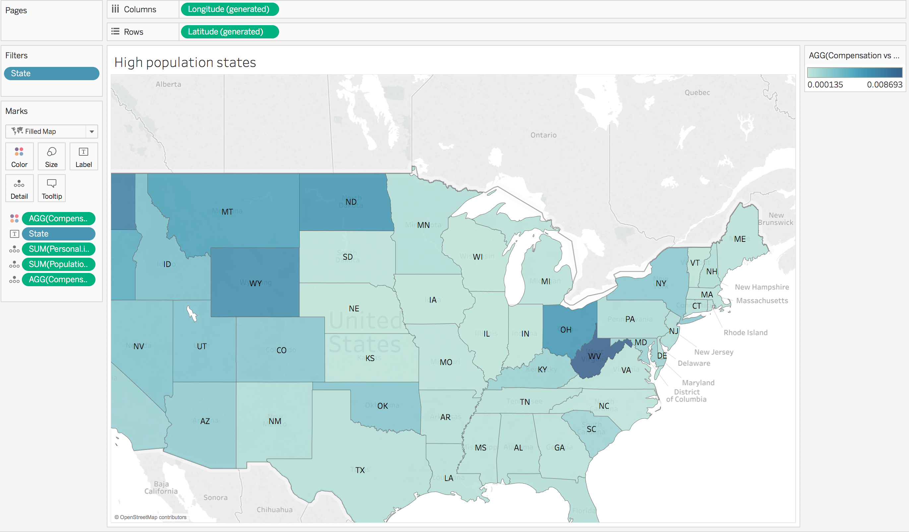
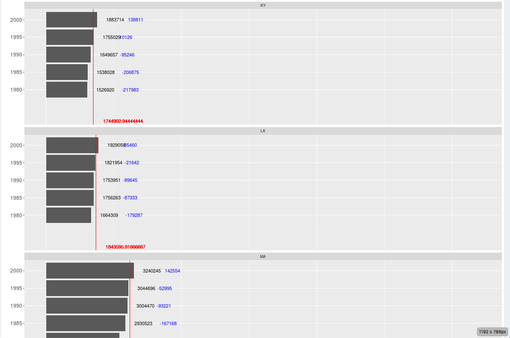
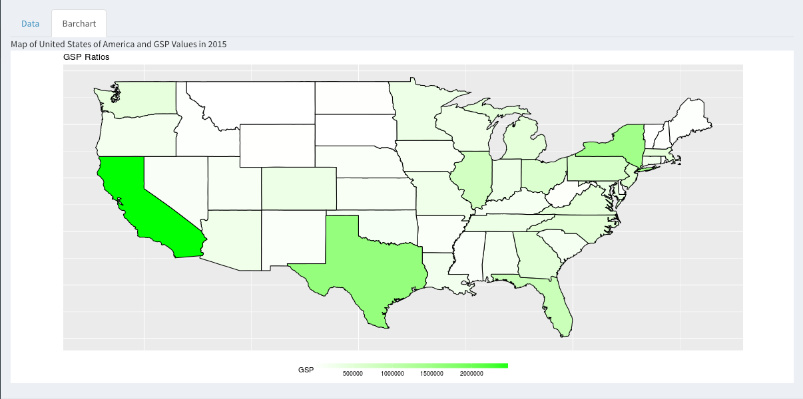
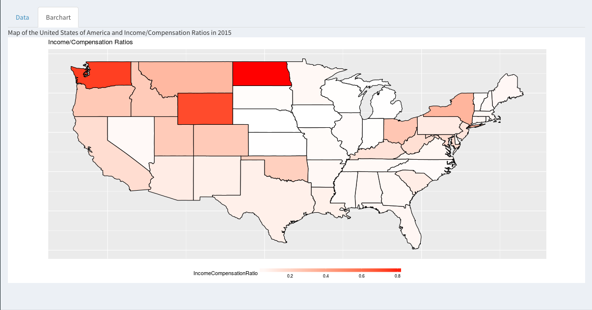

#**Introduction**
We explore the dataset that we got from http://www.ukcpr.org/data. 
The data is from The University of Kentucky Center for Poverty Research. It contains state-level panel data series covering population, employment, unemployment, welfare, poverty, and politics from 1980-2015. These data are publically available to all users.

Look at our ReadMe file to see how to access the data we used. 

#**R Configuration**
Below we display our sessionInfo().

```{r sessionInfo}
sessionInfo(package=NULL)
```
#**Tableau Visualizations**
<br>
<center></center>
<br>
This is a barchart with Employment on the Columns and State, filtered by year, on the rows. 
The black line is the state aggregated employment average, so the bars that pass the black line show that during
that year, the employment number passed the employment state average for all the years. The red and blue color coding
represents whether the employment number passed the national aggregated employment average. The difference between a certain year's employment in that state and the national average is shown as the numbers next to the bars.
<br>
<br>

<center></center>
<br>
The graph is a ID set, the graph shows the gross state products among all 50 states. There are two sets, one is high gross state product, and another one medium gross state product. The darker the blue dot means a higher gross state product percentage. One can see from the graph that northeastern states have higher gross state product percentages.
<br>
<br>

<center></center>
<br>
This is a map of all the states with their worker's compensation vs income. 
The darker the color of the state means that the employees got more worker's compensation for the amount they made.
It's interesting to note that working on the west region of the United States gives the best worker's compensation. 
Working in the central region of the United States results in poor worker's compensation for the income rate.
<br>
<br>

#**Shiny Application**
<br>

<center></center>
<br>
The above shiny visulization shows the same results as the Tableau version of the barchart.
<br>

<center></center>
<br>
The above shiny visulization shows the same results as the Tableau version of the ID set. It colors each state based on high or low GSP.
<br>

<center></center>
<br>
The above shiny visulization shows the same results as the Tableau version of the map.
<br>

#**Link to Shiny Application**
Here is the website to the shiny application : https://tesseract2010.shinyapps.io/project6/