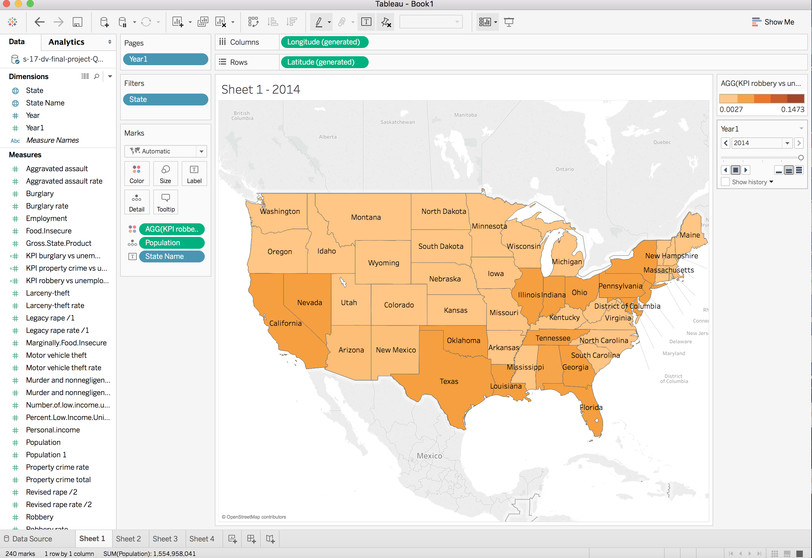
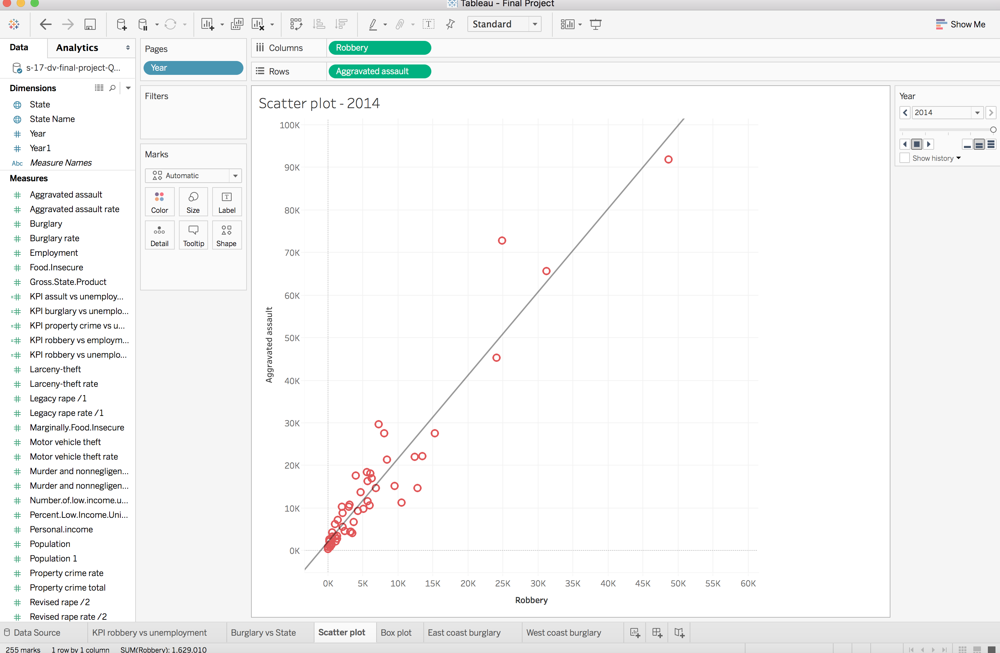

#**R Configuration**
Below we display our sessionInfo().
```{r sessionInfo}
sessionInfo(package=NULL)
```

#**Introduction**
>Crime has always been a fascinating topic of discussion. It is human nature to pay attention to gruesome murders and moral corruptness. Why? We don’t know. However, we do know that through media outlets, society has developed an ideology that unemployment leads to higher crime rates. Is this true? Through our R Notebook, we try to show the various relationships between crime and unemployment, as well as independent crime rate and state level monetary analysis in an effort to better understand the truth behind these “ideologies.” We will demonstrate step-by-step instructions on how we created various graphs and charts in Tableau as well as explore the extraordinary visualizations produced through Shiny.


#**Data**
<p>Our employment dataset came from the [University of Kentucky Center for Poverty Research (UKCPR)](http://www.ukcpr.org/data). We only focused on the columns that were related through a monetary basis (roughly the first 12 columns). Our crime data came from the [U.S. Department of Justice, FBI’s annual Uniform Crime Reporting Statistics](https://www.ucrdatatool.gov/Search/Crime/State/OneYearofData.cfm?NoVariables=Y&CFID=216489068&CFTOKEN=ee8d44efa9b4ddd-B70344C5-93BC-E9A1-9BA51707836AAC6C). We retrieved the data for all the crime categories listed on the website. Both come from very credible and respected institutions. Thus, the data is very reliable for this project.</p>


#**ETL**

<p>For both datasets we run the relevant ETL operations. We clean the data by first removing special characters (e.g. - ~) from the column names. We then decide which columns are measures and which are dimensions. 
For dimensions, we change NA to an empty string, change "&" to "and", change ":" to ";". We get rid of " and '. 
For measures, we change NA to 0. We get rid of all characters except for numbers and the - sign.</p>

```{r, echo=FALSE, message=FALSE, warning=FALSE}
source("../01 Data/etl_employment.R")
summary(df)
subset(df, state_name == "California")
```

```{r, echo=FALSE, message=FALSE, warning=FALSE}
source("../01 Data/etl_crime.R")
summary(df)
subset(df, State == "Texas")
```

#**Tableau Visualizations**
### Crosstab: Map of Robbery vs Unemployment
<center></center>
<center></center>
<center></center>
<center></center>
<center></center>
<br>

#### Description: 
<p>This is a map of Robbery vs Unemployment  per year (between 2010 and 2014). The darker the color, the higher rate of robbery per unemployment there is for each state. Notice how as we go <b>from 2010 to 2014, the Robbery vs Unemployment rate grows spreads from surrounding areas of Nevada, DC, and Louisiana, like a virus!</b></p>

#### Steps:
1. Double Click on State to show the U.S. Map
2. Click on Dimension and Create a Calculated FIeld: the formula is: SUM([Robbery])/SUM([Unemployment])
3. Drag “Year1” to pages
4. Drag the calculated field from step 2 onto Color, customize step/color to personal taste.
5. Drag “State Name” for label.
6. Drag “Population” for detail.
7. Drag “State” to Filter, and filter out Hawaii and Alaska (We are just going to look at mainland USA)


### Histogram: Burglary Rate vs State
<center></center>
<center></center>
<center></center>
<center></center>
<center></center>
<br>

#### Description: 
<p>This is a histogram, with dots showing the burglary rate (# of burglaries/100k people)  per year (between 2010 and 2014). The line represents the average burglary rate. Notice how as we go <b>from 2010 to 2014, the burglary rates decrease significantly.</b></p>

#### Steps:
1. Click on Analysis and Unselect “Aggregated Measures”
2. Drag “State Name” to Columns
3. Drag “Burglary Rate” to Rows
4. Drag “Year” to Pages
5. Drag Measure Names to “Color”, change color as desired
6. Go to Analytics and drag Average Line onto graph and select “Pane Line”

### Scatterplot: Aggravated Assaults and Robbery
<center></center>
<center></center>
<center></center>
<center></center>
<center></center>
<br>

#### Description: 
<p>This is a scatterplot showing the relationship between Aggravated Assaults and Robbery per year (between 2010 and 2014). <b>We can see a strong positive linear association between Robberies and Aggravated Assaults through the trend line displayed.</b></p>

#### Steps:
1. Click on Analysis and unselect “Aggregated Measures”
2. Drag “Aggravated Assaults” to Rows
3. Drag “Robberies” to Columns
4. Drag “Year” to Pages
5. Right click on the graph and click “Trend Lines,” unselect confidence band. The slope seems to be nearly the same for 2010 to 2013. However, the slope is a little steeper in the year 2014, which means that the aggravated assaults is higher than the previous years. 

### Boxplot: Year vs Property Crime Rate
<center></center>
<br>

#### Description: 
<p>This is a boxplot of property crime rate based on each year. We can see that the <b>property crime rate is slowly decreasing (median wise) as the years progress.</b> DC has the highest property crime rate for all years. They only become outliers for the years: 2012, 2013, and 2014. This means the property crime rate actually decreases for all the other states per year, which makes DC an outlier. </p>

#### Steps:
1. Click on Analysis and unselect “Aggregated Measures”
2. Drag “Year” to columns
3. Drag “Property Crime Rate” to rows
4. Drag “Year” to color
5. Drag “State” to Detail
6. Go to “Analytics” and drag average line to the chart and select Pane Line
7. Click on Box Plot on the righthand side.

### Barchart: State and Year vs Burglaries
<center></center>
<center></center>
<br>

#### Description: 
<p>This is a bar chart showing the number of burglaries on each state per year. We manually filtered by big east coast states and west coast states. Notice how <b>West Coast burglaries is significantly higher (around 30k more) than the East Coast  burglaries. This could be because of the small number of states classified as “west coast,” giving a large standard deviation.</b></p>

#### Steps:
1. Click on Analysis and unselect “Aggregated Measures”
2. Drag “Year” and “State” to Rows
3. Drag “Burglaries” to Columns
4. Right click on “Burglaries” and select “Measures” then “Average”
5. Drag “State” to Filter and select designated states.
6. Go to “Analytics” and drag average line to the chart and select Pane Line


#**Shiny Application**
<br>

### Crosstab: Crime to employment ratio
<center></center>
<br>

#### Description: 
<p>The Crosstab plots a Crime to Employment Ratio and analyzes every state over the course of 2010-2014. <b>Results indicate that D.C has the highest crime rate by far. </b> Despite changing the sliders multiple times, the area stays with a high KPI. Most nations experience a medium KPI under most settings. <b>The most peaceful nations seem to be Vermont and Wyoming. Vermont especially keeps a very low KPI in almost all settings. </b>
</p>
<br>

### Histogram: Employees aggregated every year
<center></center>
<br>

#### Description: 
<p>The histogram outlines number of employees aggregate every year from 2010 to 2014. Each year has a different histogram. The bucket size for the histograms are 200000 because of how varied populations are across the states. <b>The biggest increase in overall employment happened between 2010 to 2011</b>, though this growth was slow. After that employment seems to have been increasing very slowly the next 2 years.
</p>
<br>

### Scatterplot: Food Insecurity vs Violent Crime Rate
<center></center>
<br>

#### Description: 
<p>The scatter plots a food insecurity ratio on the Y axis and the violent crime rate on the X axis. The only real outlier in terms of results is California which experiences a lower food insecurity but the highest crime rate by far. In terms of interesting results, <b>Mississippi experiences a huge drop in food insecurity after 2010 and then slowly goes back up starting in 2011. It’s interesting because it starts off as the highest in food insecurity and then goes down by a lot, but the violent crime rate stays the same.</b> 2014 seems to indicate that food insecurity on average has gone up by a lot more than in past years. There are very few states with a 10 or less food insecurity ratio.
</p>
<br>

### Boxplot: State vs GSP 
<center></center>
<br>

#### Description: 
<p>The boxplot outlines each independent state and their GSP (Gross State Products) over 2010-2014. California has by far the largest GSP with its lowest value of 1953411 being higher than any other state's GSP . Texas comes in second place followed by New York. These states also have the biggest gaps between the top and bottom of their boxes. The smaller GSP’s are all much more knit together. <b>Vermont has all 5 of the lowest GSP values, but it’s GSP has been going up over the past few years.</b>
</p>
<br>

### Barchart: Violent Crimes Per Year
<center></center>
<center></center>
<br>

#### Description: 
<p>The black on the barchart represents the total number of violent crimes done. Each state has an independent graph showcasing the number of crimes done from the years 2010-2014. The red line represents the mean number of violent crimes done in that particular state over the timespan. The blue line represents the difference between the mean and the respective year.  <b>The range between the state with the least number of crimes and the highest number of crimes was shocking. California has averaged close to 158000 crimes a year while Vermont has averaged only around 800 a year.</b> Outside of that, the results seemed to indicate that murder rate has stayed fairly consistent in most of the US around the time period.</p>
<br>


#**Conclusion**
<p>Through the data, one can see many interesting observations. From Robberies being spread from surrounding areas of Nevada, DC, and Louisiana to other states to how west coast burglaries are significantly more than east coast burglaries, we are able to get a broad idea of the rate at which crimes are happening in recent years. Regardless of how a state is doing, in terms of monetary stability or unemployment rates, we have observed burglary rates and property crime rates decreasing throughout the years. It is safe to assume, that as the years increase, given all situations are static, that the following years to come won’t be a “Prime Time for Crime.”</p>

#**Link to Shiny Application**
Here is the website to the shiny application : https://tesseract2010.shinyapps.io/finalproject/

